# WinChangeMonitor (README)

WinChangeMonitor is a Windows desktop application that helps you understand what a third-party executable or script changes on a machine. It captures a **baseline inventory**, lets you run the target program, captures a **post-execution inventory**, and then generates a **diff report** showing **added / modified / deleted** changes across the monitored domains.

---

## What our product is

WinChangeMonitor is built for developers, system administrators, and security-minded users who need **transparent, repeatable change detection** when running unverified, legacy, closed-source, or “mystery” software.

### Core workflow
1. Create a **Baseline Inventory** (pre-run)
2. Run the **third-party executable/script**
3. Create a **Post-Execution Inventory** (post-run)
4. Run **Difference Analysis**
5. View **human-readable reports** and optional exports

### What it can monitor (depending on what’s enabled/configured)
- **File system** changes (folders/files)
- **Windows Registry** changes (keys/values)
- **Windows Services** changes (state/configuration)

### Outputs
- Human-readable report (HTML)
- Optional structured exports (JSON/XML) and optional PDF (if implemented/enabled)

---

## Tools you need

### For users (running the app)
- Windows OS (WinChangeMonitor is Windows-only)
- **.NET Framework 4.8 Runtime**

### For developers (building from source)
- Windows OS
- **Visual Studio** with the **“.NET desktop development”** workload (WinForms)
- **.NET Framework 4.8 Developer Pack / Targeting Pack**
- Git (to clone the repository)

---

## Installation instructions

<!-- TODO: Add installation steps (keep blank for now) -->

---

## Additional libraries you might need

These are typical NuGet / implementation dependencies referenced by the project design and planned features. Exact names/versions should match the solution once implemented:

- **MessagePack** (binary serialization/persistence for inventories/config/settings)
- Optional: SQL database support (only if/when SQL persistence is enabled)
- Optional: any diff/reporting helpers used by the implementation
- Optional: persistence backends explored/benchmarked (only if adopted)

---

## Building from source (recommended)

1. Clone the repository
2. Open the main solution in Visual Studio
3. Ensure configuration is set to **Release** (or Debug for local dev)
4. Build and run

---

## User Guidelines (WinChangeMonitor)

1. Launch **WinChangeMonitor**
2. Enable the monitors you want (File / Registry / Services)

   This button can enable/disable File System Monitor
   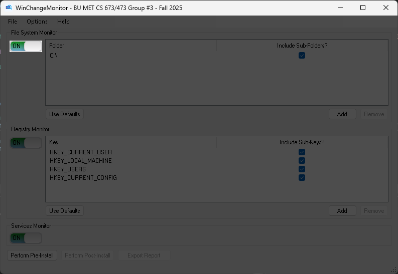

   This button can enable/disable Registry Monitor
   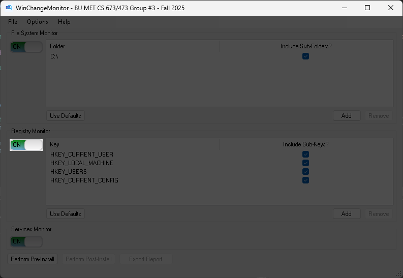

   This button can enable/disable Services Monitor
   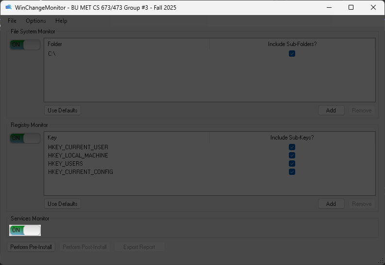

3. Select the folders / registry keys / services to track

   This section shows the folders you selected for File System Monitor. Click the checkbox(es) to include/exclude subfolder(s) for monitoring.
   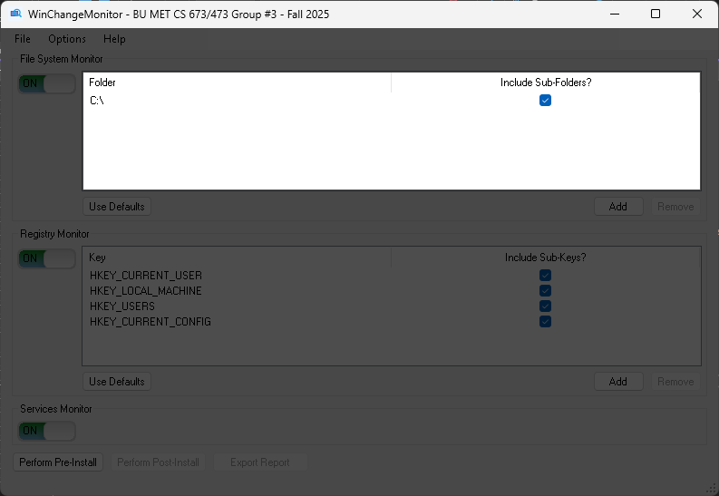

   This section shows the folders you selected for Registry Monitor. Click the checkbox(es) to include/exclude subfolder(s) for monitoring.
   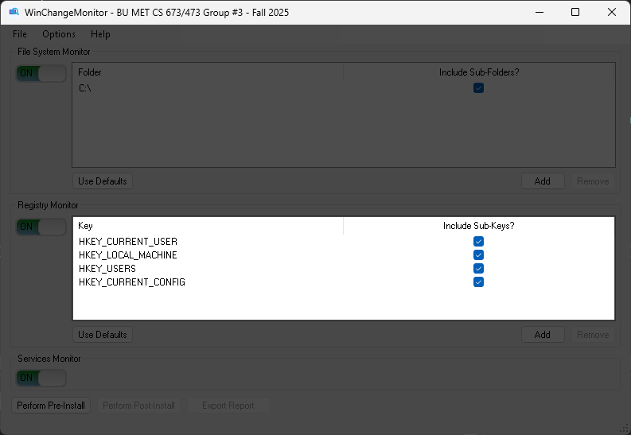

4. Add or remove folders / registry keys /services to track

   This button can add new folders for File System Monitor
   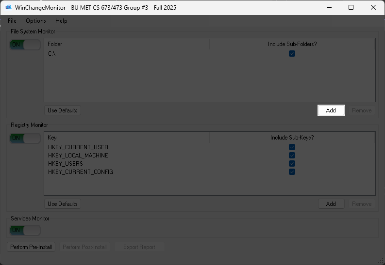

   After selecting a folder, use this button to remove this folder from File System Monitor
   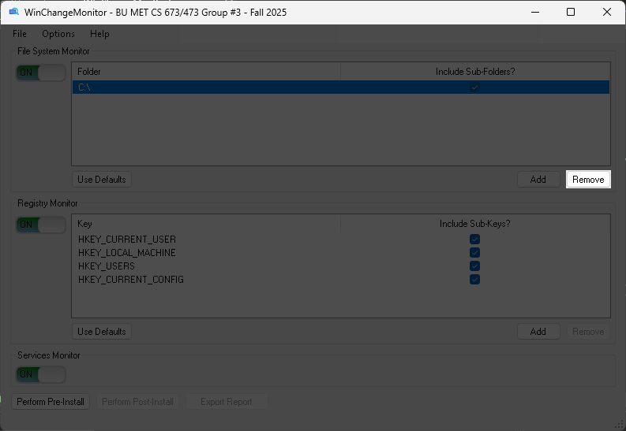

   This button can add new registry keys for Registry Monitor
   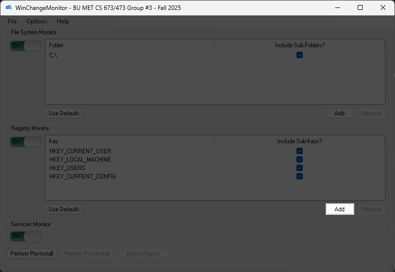

   After selecting a folder, use this button to remove this key from Registry Monitor
   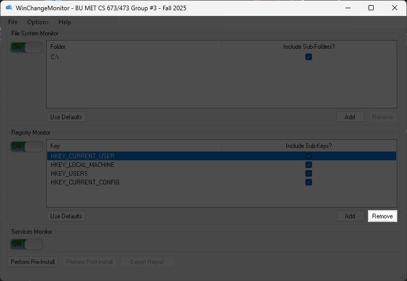
   
> Tip: Some registry/service monitoring may require running as Administrator.
   
5. Run **Perform Pre-Install** by clicking this button (baseline scan).
   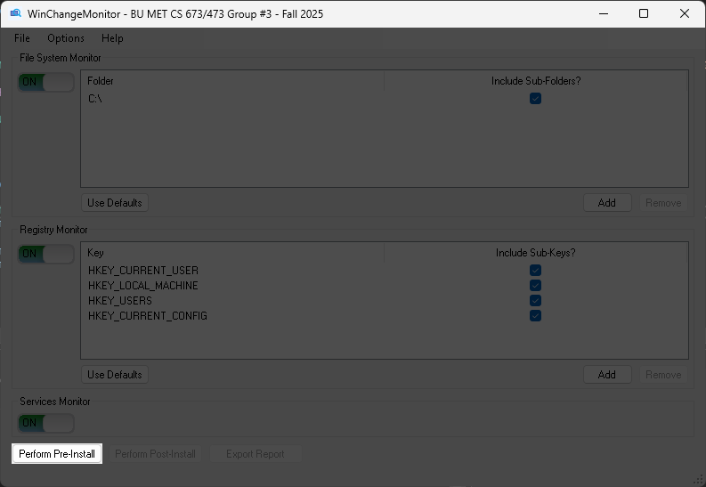
   
6. Execute the third-party program or installation.
7. Run **Perform Post-Install** by clicking this button (post scan).
   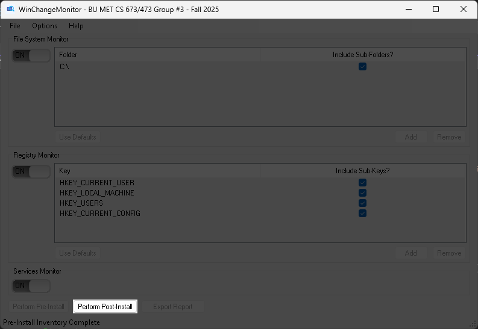
   
8. Export the report by clicking this button. The report will include New / Modified / Deleted entries, separated by monitored section.
   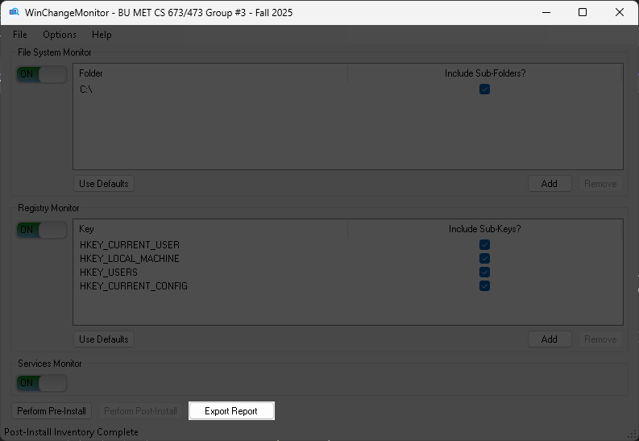
   
9. There are three tabs at the top left corner:

   Click File tab and then Exit button to close the program.
   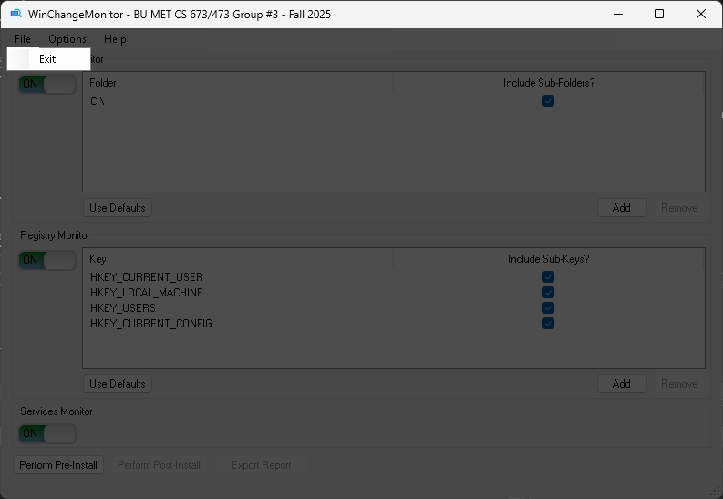

   Click Options tab and then select whether to ignore unecessary folders for monitoring.
   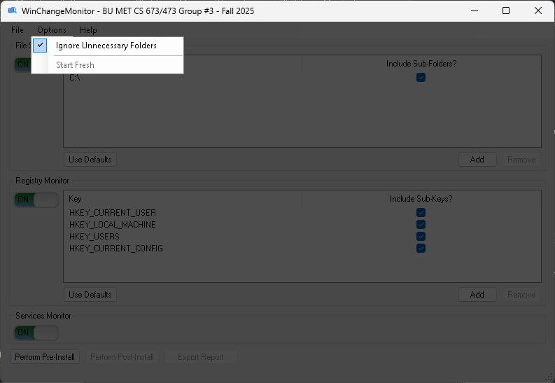

   After performing post-install scanning, start a fresh scan by click Options tab and then click the Start Fresh button.
   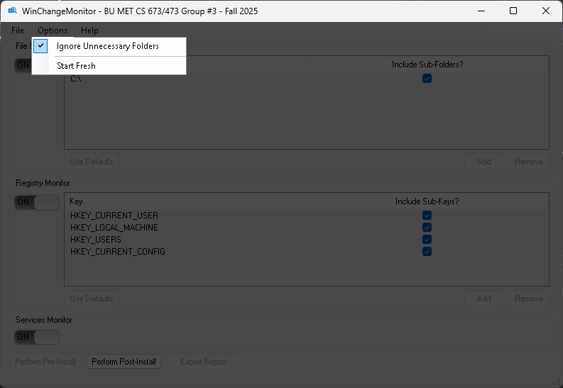

   Click Help tab and then About button to learn more basic information on this application.
   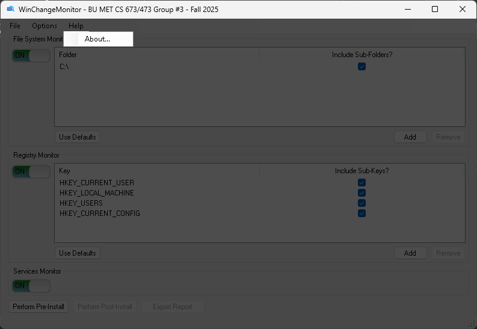

---

## TestFramework (demo + testing helper)

This repository includes a companion tool named **TestFramework** intended for testing and for the demonstration video workflow. It simulates an “installer-like” program that makes file/registry/service changes so WinChangeMonitor can detect and report them.

### Safety note (important)
TestFramework is an executable helper project. As a safety measure:
- Open **`TestFramework.sln`**
- **Review the code** before running anything
- Set build configuration to **Release**
- **Build it yourself locally** (do not rely on a prebuilt binary)

### Demo / test flow

1. Create a target folder anywhere you like (example used below):
   - `C:\Users\J\Desktop\TestTarget`

2. Run the following sequence:

   **A) Create baseline changeset (pre)**
   - From Command Prompt:
     - `TestFramework.exe -folder "C:\Users\J\Desktop\TestTarget" -pre`
   - Then in **WinChangeMonitor.exe**:
     - Click **Perform Pre-Install**

   **B) Simulate install / change activity**
   - From Command Prompt:
     - `TestFramework.exe -folder "C:\Users\J\Desktop\TestTarget" -runInstall`
   - Then in **WinChangeMonitor.exe**:
     - Click **Perform Post-Install**

   **C) Review output**
   - Review the generated report; it should have entries across all monitored sections (files / registry / services if enabled).

3. Cleanup when finished:
   - From Command Prompt:
     - `TestFramework.exe -folder "C:\Users\J\Desktop\TestTarget" -cleanup`

### Notes
- TestFramework was updated (or is being adjusted) to allow users to specify arguments via the **command line** (the folder path was previously hard-coded during development).
- Depending on what the framework simulates, you may need to run Command Prompt as **Administrator**.

---

## Repo / workflow notes

- Use feature branches + pull requests
- Prefer peer review before merging to `main`
- Track work via the team’s issue tracker (e.g., JIRA)

---

## License

<!-- TODO: Add license info -->
